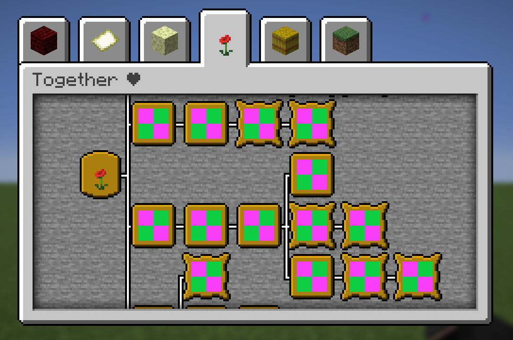

<!-- markdownlint-disable MD033 MD041 MD007 -->

<!-- pretty badges -->
<div align="center">
  
  
  
  
</div>

# ⚡ Our Datapack ❤

This project is part of our Minecraft Server with Anastasia. It creates a bunch of advancements for our couple!

<div align="center">
  
  <p align="center"><b>Figure 1:</b> Advancement Tree</p>
</div>

## 📜 Features

- **Datapack** containing all our **advancements**.
- Cute resourcepack with our **custom thumbnails** for our advancements! 🎨✨
- Small [Python Script](/src/helper.py) to generate relevant files for the **resourcepack**.

## ⚙️ Installation

1. Clone the repository:

    ```sh
    git clone git@github.com:Ant0in/Our-Datapack.git
    ```

2. Drop the datapack [**`/src/us_datapack`**](/src/us_datapack/) in your `/datapack` folder in your **server's world**.

3. Drop the resourcepack [**`/src/us_resourcepack`**](/res/us_resourcepack/) in your `/resourcepack` folder in your **minecraft instance**.

Make sure the version of the pack is **suiting your minecraft version**. See [Pack Format](https://minecraft.wiki/w/Pack_format) for more details.

## 📄 License

This project is licensed under the **MIT License**. See the [LICENSE](LICENSE) file for more details.
